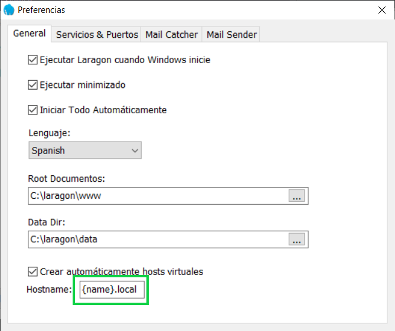
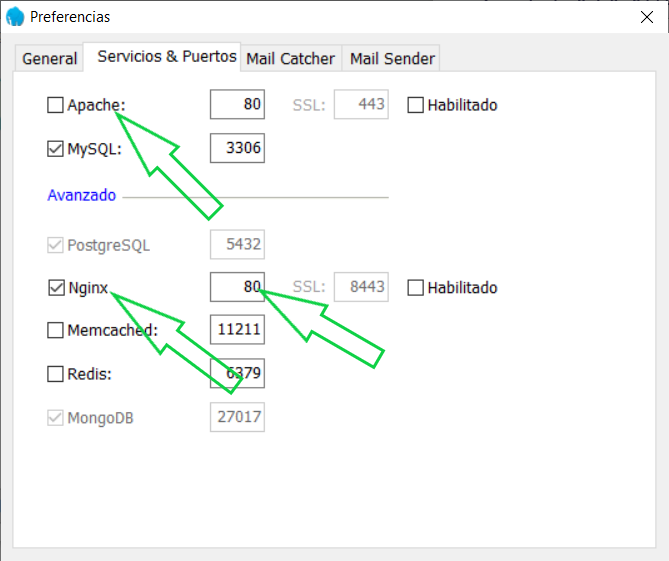
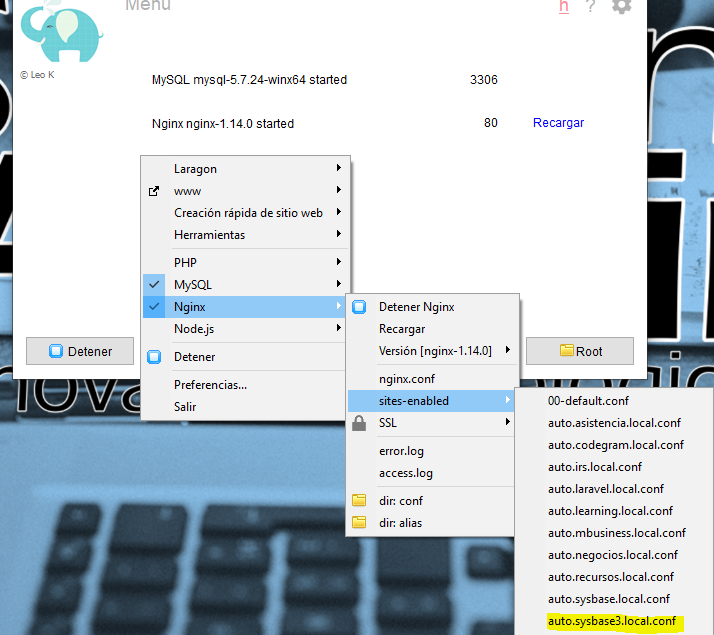
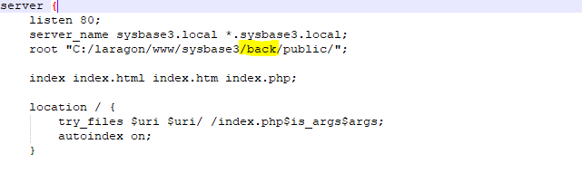
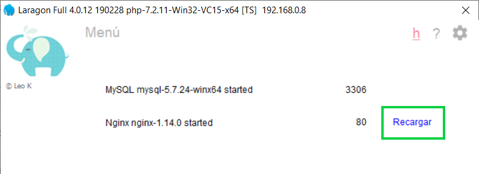

## Instalación
 
 ### Programas necesarios

  #### Laragon https://sourceforge.net/projects/laragon/files/releases/4.0/laragon-full.exe
        
  #### Visual studio code  https://code.visualstudio.com/Download    
 
 ### Crear una base de datos llamada sysbase
   
     (Esto en cualquier administrador de base de datos como heidi)
     
 ### Configuraciones para laragon
 
 #### Cambiara {name}.test por {name}.local
     
  
 #### Desmarcar casilla de apache, marcar casilla de Nginx y cambiar el puerto del mismo a 80
 
 
     
  ### Ejecutar los siguientes comando en la terminal que incluye laragon 
  
  
    
  ##### clonar repo
    git clone https://github.com/altamiranoesdras/sysbase.git

  ##### Acceder a la carpeta de laravel  
    cd sysbase3
    cd back
    
  ##### instalar dependencias
   
    composer install 		
  
  #### crear archivo de entornos
  
    cp .env.example .env   
    
  ##### generar clave de encryptacio para seguridad de la aplicación
    php artisan key:generate  
  
  ##### crear tablas y datos
    php artisan migrate --seed
    
  ##### Instalar clientes por defecto de Laravel Passport (Autenticación para apis) 
     php artisan passport:install
  
  
  ##### Acceder a la carpeta de nuxt  
      cd ..
      cd front
    
  ##### instalar dependencias
   
    npm install 		
  
  ##### Editar Virtual Host
  
  
  
    agregar /back a root
  
  
  
  ### Recargar servidor web de laragon para que se genere el virtual host
  
  
     
  ### Puedes ingresar por el navegador con  http://turismo.local/   
     
  #### Credenciales de acceso
    Usuario : admin
    Password : admin
 

